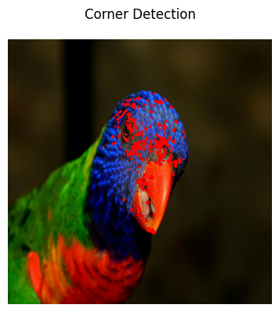
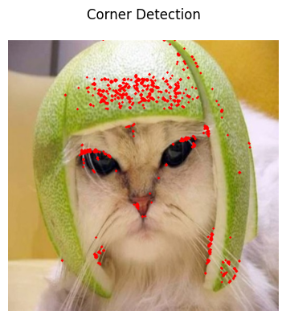
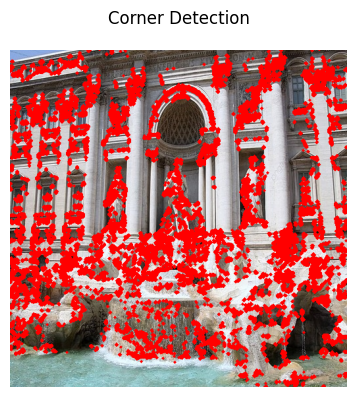

# Computer-Vision Tasks (from scratch):
---


## Pre-requisites:
To run the project, it is advised to make a virtual environment and install the required packages. To do so, follow the steps below:

1. Create a virtual environment using the following command:
``` bash
conda create --name CV python=3.10
```
2. Activate the virtual environment using the following command:
``` bash
conda activate CV
```
3. Install the required packages using the following command:
``` bash
pip install -r requirements.txt
```

## Task A:
Add noise to the images and remove it using various smoothening filters. Apply Canny Edge Detection to the images.

<image src="src/taskA/results/original.png" height="250"> <image src="src/taskA/results/self.png" height="250"> <image src="src/taskA/results/heatmap.png" height="250">

## Task B:
Implement Gaussian Pyramid Downsampling from scratch. Implement Image Blending using Laplacian Pyramid. Finally apply Harris and Hessian Corner Detection algorithm.

<image src="src/taskB/results/blend.png" width="880">



## Task C:
Implement Panorama Stitching from scratch.

<div style="display: inline-block;">
    
    
    
    
    
</div>


## Task D:
Implement Lucas-Kanade Optical Flow Algorithm from Scratch


  


## Task E:
Estimate the Camera Matrix between pair of Stereo Images by finding the matching points. Finally find the disparity map for the stereo images.

 <image src="src/taskE/results/disparity/1.png" height="250"> <image src="src/taskE/results/disparity/2.png" height="250"> <image src="src/taskE/results/disparity/3.png" height="250"> 