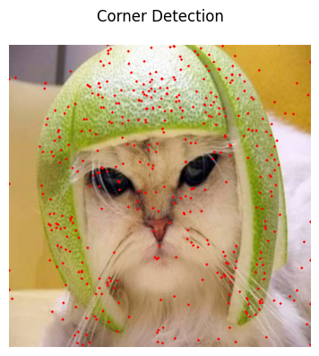

# Task B:
The jyputer notebook `taskB.ipynb` contains the code for the project. The code is written in python and all the functions are implemented from scratch without using openCV's inbuilt functions.

### Part 0:
- Original images:

### Part 1:
- Implement Gaussian Pyramid Downsampling from scratch and observe the difference with the openCV.resize() function. The result of the rome image is shown below:

### Part 2:
- Implement image blending technique using Laplacian Pyramid from scratch. The result of the blending of two images is shown below:

### Part 3:
- Apply Herris Corner Detection Algorithm from scratch on the image and plot the detected corners on the image.

- Apply Hessian Corner Detection Algorithm from scratch on the image and plot the detected corners on the image.

