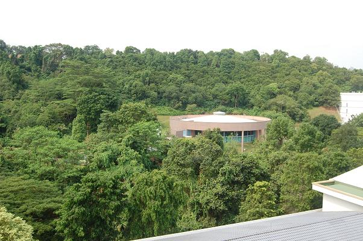
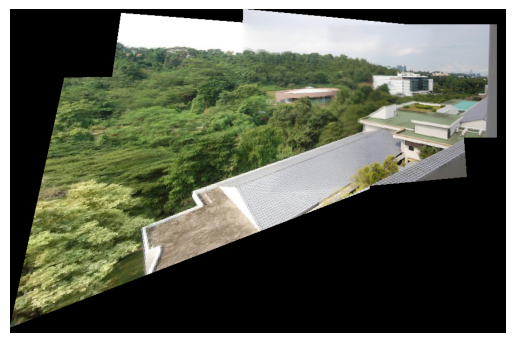

# Task C:
The ```main.py``` is the driver file for the image stitching task. The ```functions.py``` file contains all the functions required for the task. The code is written in python and all the functions are implemented from scratch without using openCV's inbuilt functions.

### Part 0:
- Original overlapping images 1:

<div style="display: inline-block;">
    
    
    
    
    
</div>


- Original overlapping images 2:
<div style="display: inline-block;">
    
    
    
    
    
</div>


### Part 1:
- Implement Panaroma Stitching using SIFT feature detection and BFMatcher from openCV. Use these to warp the images and stitch them together as a Panaroma. Do not use the inbuilt functions of openCV for warping stitching. The results of the stitching of the images are shown below:




### Important Note:
- Running the code is computationally expensive, so the images has been scaled down by a factor of ```0.7``` in order to reduce the computational time. 
- If you have a powerful machine, you can navigate to ```functions/Helpers/Master.py``` and change the ```SCALE``` to ```100``` in order to see the actual results.
- The ```Helpers``` module also has python files for each step in the pipeline of Panorama Stitching. Running individual files will give you the results of each step saved in the respective folders.

