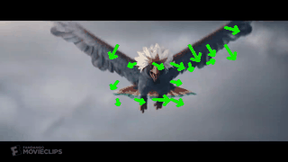

# Task D:
The jyputer notebook `taskD.ipynb` contains the code for the project. The code is written in python and all the functions are implemented from scratch without using openCV's inbuilt functions.

### Part 0:
- Original videos:

  

### Part 1:
- Implement the Lucas-Kanade Optical Flow Algorithm from scratch without using opencv's inbuilt functions.

  

### Part 2:
- Using the optical Flow algorithm written above, perform image warping between frames at distanece of 8.

