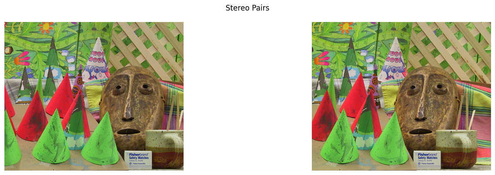
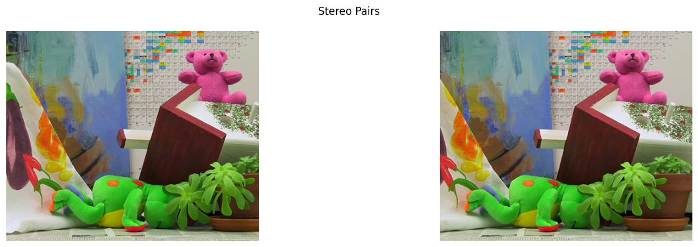
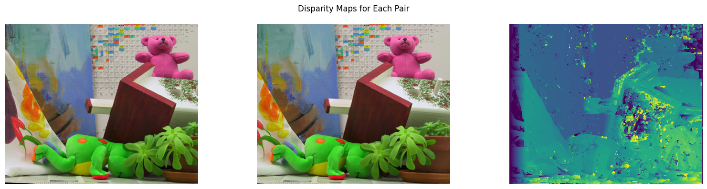

# Task E:
The jyputer notebook `taskE.ipynb` contains the code for the project. The code is written in python and all the functions are implemented from scratch without using openCV's inbuilt functions.

### Part 0:
- Original Stereo Pairs:

### Part 1:
- Find the matching points between image pairs without using OpenCV's inbuilt functions. The results of the matching points are shown below:

### Part 2:
- Estimate the camera matrix [R | t] using matched points in Question 1.

Camera matrix for pair 0: 

$$
\begin{bmatrix} 
9.99999969e-01 & 2.48313147e-04 & 4.33836813e-06 & -9.99851452e-01 \\ 
-2.48313164e-04 & 9.99999969e-01 & 3.74275525e-06 & 1.72356479e-02 \\ 
-4.33743862e-06 & -3.74383241e-06 & 1.00000000e+00 & 7.37989055e-05 
\end{bmatrix} \\
$$

Camera matrix for pair 1:

$$
\begin{bmatrix} 
9.99996889e-01 & -2.49444201e-03 & -1.59094339e-05 & -9.99268979e-01 \\ 
2.49444136e-03 & 9.99996888e-01 & -4.05699082e-05 & -3.82269879e-02 \\ 
1.60105836e-05 & 4.05300968e-05 & 9.99999999e+00 & -4.52322938e-04 
\end{bmatrix} \\
$$

Camera matrix for pair 2: 

$$
\begin{bmatrix} 
9.99998189e-01 & 1.90306300e-03 & 1.60347674e-05 & -9.99909473e-01 \\ 
-1.90306317e-03 & 9.99998189e-01 & 1.06560078e-05 & 1.34545300e-02 \\ 
-1.60144593e-05 & -1.06865037e-05 & 1.00000000e+00 & 1.48387620e-04 
\end{bmatrix} \\
$$

Camera matrix for pair 3: 

$$
\begin{bmatrix} 
9.99998731e-01 & -1.59298168e-03 & -2.70361718e-06 & -9.99957300e-01 \\ 
1.59298170e-03 & 9.99998731e-01 & 5.52845399e-06 & -9.24105674e-03 \\ 
2.69480702e-06 & -5.53275378e-06 & 1.00000000e+00 & 3.61160375e-05 
\end{bmatrix} \\
$$

Camera matrix for pair 4: 

$$
\begin{bmatrix} 
9.99999346e-01 & -1.14346364e-03 & -3.40561769e-06 & -9.99907601e-01 \\ 
1.14346358e-03 & 9.99999346e-01 & -1.65337360e-05 & -1.35929229e-02 \\ 
3.42452119e-06 & 1.65298310e-05 & 1.00000000e+00 & -1.51097711e-04 
\end{bmatrix} \\
$$

### Part 3:
- Perfrom stereo rectification for each pair based on the estimated camera matrix, without using OpenCV's inbuilt functions. The results are not shown here but can be found in the `results/rectified` folder as well as in the `taskE.ipyb` notebook.

### Part 4:
- Find Disparity Map for each pair with the help of stereo rectification images without using OpenCV's inbuilt functions. The results of the disparity maps are shown below:

