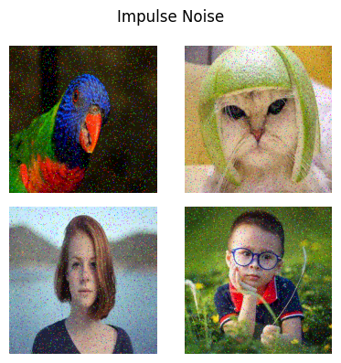
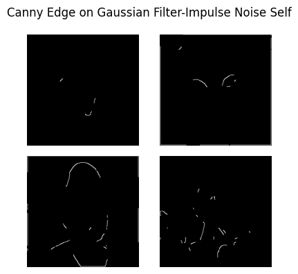
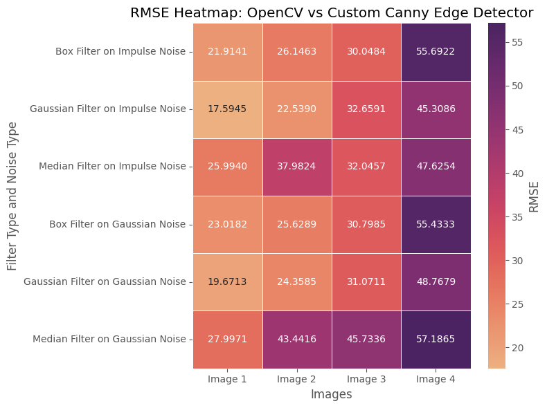

# Assignment A
The jyputer notebook `Assignment_A.ipynb` contains the code for the assignment. The code is written in python and all the functions are implemented from scratch without using openCV's inbuilt functions.

### Part 0:
- Original images:

### Part 1:
- Add Impulse Noise to the images:

- Add Gaussian Noise to the images:

- Vary the parameters of the noise to analyses the effect on the image

### Part 2:
- Apply Box Filter to the noisy image:

$$
G[i, j] = \frac{1}{(2k+1)^2} \sum_{u=-k}^{k} \sum_{v=-k}^{k} F[i+u, j+v]
$$

- Apply Gaussian Filter to the noisy image

$$
G[x,y] = \frac{1}{2\pi\sigma^2} e^{-\frac{x^2+y^2}{2\sigma^2}}
$$

- Apply Median Filter to the noisy image

$$
G[x,y] = \frac{1}{mn} \sum_{x=-a}^{a} \sum_{y=-b}^{b} F[x,y]
$$

### Part 3:
- Apply Canny Edge Detection Algorithm from Scratch
    - Use two type of noise: Impulse and Gaussian (Part 1)
    - Use three type of filters: Box, Gaussian and Median (Part 2)
    - Total 6 combinations of noise and filters. The results of the best perfomring combination is shown below:

- Calculate the RMSE of the edge detected image using openCV's Canny Edge Detection Algorithm and the edge detected image from scratch. Plot the Heatmap of the RMSE values.

